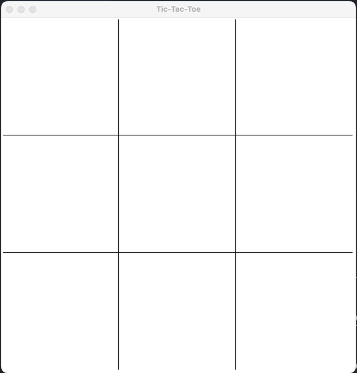

# Tic-Tac-Toe
The game features a graphical user interface that displays a 3x3 grid for players to place their symbols (X or O) and buttons for resetting the game. The game begins with a blank grid, and each player takes turns placing their symbol on an empty grid space.

The game logic is handled by the Python code, which checks for the winning condition after each player's turn. If a player has three of their symbols in a row (horizontally, vertically, or diagonally), the game declares that player the winner. If all the spaces are filled and no player has three in a row, the game is declared a draw.

Run main.py to play sudoku.

```
python main.py
```

# Instructions
Click on a square to place down a X or a O. The player with 3 in a row wins and gets a point added to their total number of wins. If there is a tie the code adds a point for the tie catagory. To exit game close out the window.


